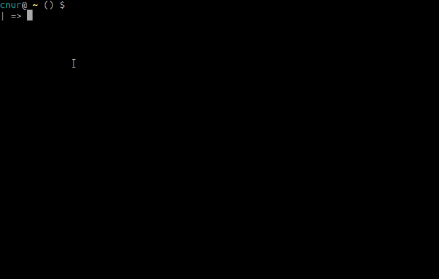

Daemon for the utask productivity tool that aims to boost focus by dissecting complex projects into small chunks of increments called utasks ( micro tasks ).

## About utask
Feeling like doing work, all the while, staring at a screen with disarranged thoughs and random behaviour is a ubiquitous time waster.
This seems to stem from four reasons, distraction, not having clear goals, getting stuck in complexity or diving deep into unnecessary details.
The large amount of idle time can be optimised by focused chunks of systematic effort that dissolve complex projects into simple incremental tasks, that is what this project is about.

- first step is dissecting projects into utaks ( microtasks ), which are self contained increments of work
- utasks are tackled one at a time with highly focused 20-30 minute sessions in manner similar to the pomodoro technique
- each utask is registered on a database for a post mortem after project completion

Breaking down the project to simple self contained units of workload helps with timeline estimation to completion.
Moreover, it provides a method to measure personal productivity levels. For example, this tool consisted of 23 utasks which were completed on a course of
6 days, averaging 4 utasks per day. For future projects, effort estimations can be done in units of utasks, providing an accurate evaluation of the timeline. 

## utask daemon

This is the daemon that handles utask requests from utask cli. It is intended to run as a background service, likely to  be registered with a service manager such as systemd. 
It listens over a Unix socket expecting requests in form of Rest APIs, employing a similar architecture to Docker Cli <-> Docket daemon interface.
Some of the cutting-edge libraries included in this package are Viper, Logrus, Gorilla Mux.

## Installation

Only manual installation is supported currently. Package manager installation will be available in the near future.
Manual installation:

## Contribution

1. please check out tagged issues, and feature improvements
2. as usual create a feature branch  `$ git checkout https://github.com/golark/utaskdaemon -b <featurebranch>`
3. test and submit pull request ( feature -> develop )

Following Gitflow guidelines. Code walkthrough can be arranged for the keen contributor. Any questions, please feel free to drop me a line.

#### Architecture

utask daemon is intended to run as a service serving requests from utask cli over a Unix Socket using Rest APIs.
This architecture is similar to the Docker daemon/cli interaction.
Once a request has been made by the utask cli checks the request parameters before forwarding the request to the daemon. 
The daemon further checks whether the request can be served and returns a confirmation to the cli. Utask cli can return without blocking
after the delivery of the request to the daemon. From this point on, the utask daemon serves the request as a best effort. 

Systemd is employed as the service manager on Linux OS. Although there is no strict requirement for the choice of a service manager,
consistency across developers is a sound practice. During the development phase the installation of the service will be done manually, please see
this link for instructions on how to do this.

##### Directory structure and files

    .
    ├── cfg                         # configure unixsocket, http, rest api, graceful shutdown and timer requests
    |   ├── cfgmain.go              # socket setup, configure listener, handle shutdown requests
    |   ├── cfgtimer.go             # handle timer requests, setup user notifications for single shot utask
    |   ├── cfg_test.go             # module test   
    ├── db                          # database access
    |   ├── saveutask.go            # save utask to database or to csv
    |   ├── saveutask_test.go       # module test
    ├── httpmux                     # multiplexer for http interface
    |   ├── ping.go                 # handle ping requests
    |   ├── starttimer.go           # start a single shot utask timer
    |   ├── httpmux_test.go         # module test
    ├── media                       # images for project logo and installation demonstration
    |   ├── utasklogo.png #
    |   ├── utasklogo_withprint.png #
    ├── config.yaml                 # configuration for the project  
    ├── go.mod                      # required modules
    ├── install.sh                  # for manual installations
    ├── LICENSE                     # 
    ├── main.go                     # entry point, configure logrus & viper, read config, handle signals
    ├── README.md                   #
    ├── utaskdaemon.service         # service descriptor for systemd
    └ 
### Copyright and license

Code and documentation released under the [Apache 2.0 License](LICENSE) 
 
